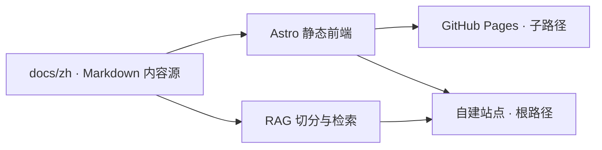

# Archipelago


> 把 MIT 公开课的学习笔记整理成一组彼此关联的学科岛屿，而不是互不相干的课程文件堆——目前以计算机科学为主，正逐步纳入心理学、管理学等领域。

[自建站点](https://notes.lobomiao.uk) · [GitHub Pages 镜像](https://luomingguo.github.io/archipelago/)

## 项目定位

Archipelago（群岛）起源于个人公开课学习笔记，但目标不只是按课程陈列文件。项目希望保留课程脉络的同时，通过领域、课程、讲义、概念和内部链接组织内容，让读者能回答三个问题：这篇在讲什么、需要先读什么、接下来可以读什么——不同学科是各自独立的岛屿，内部链接和知识关系则是连接它们的航线。

当前内容以中文为主，覆盖计算机系统、计算机架构、理论计算机科学、计算机安全、编程语言、软件工程、开源项目研读与知识索引。站点目录目前从真实 Markdown 自动生成，共收录 **462 篇正文、27 门课程、8 个领域**；这些数字会随内容更新而变化。心理学、管理学等目录已在仓库中预留（`docs/zh/psy/` 等），但尚无正式笔记上线。

这不是 MIT 官方项目，也不是课程讲义的逐字翻译。笔记包含个人整理、代码示例、习题记录和对不同课程之间联系的归纳，内容完整度以各文件的 `status` 标记为准。

## 主要能力

- **结构化知识入口**：提供主页、领域页、课程页和讲义页，不必从文件树猜测阅读路径。
- **面向技术内容的阅读体验**：支持数学公式、代码高亮、表格、图片、标题锚点、语义容器和深浅色主题。
- **真实内容驱动的导航**：课程树、上一篇/下一篇、页内目录、反向链接和相关内容均从 Markdown、目录结构、内部链接或 Git 历史推导。
- **全站搜索**：使用 `⌘/Ctrl + K` 打开搜索面板，可检索领域、课程和讲义，并支持键盘操作。
- **响应式讲义页**：宽屏使用课程导航、正文与关系信息三栏布局；平板和手机端折叠为适合连续阅读的结构。
- **RAG 问答**：自建站点可通过同源流式接口检索笔记并生成带出处的回答；静态镜像不会展示一个无法使用的问答入口。
- **稳定的静态发布**：同一份内容同时支持自建域名根路径和 GitHub Pages 子路径，构建时会检查路由、链接、资源和标题锚点。

## 内容与系统架构

`docs/**/*.md` 是唯一的笔记源文件。中文课程按 `docs/zh/<学科>/<领域>/<课程>/` 组织；现有计算机课程位于 `docs/zh/cs/`，后续心理学与管理学可分别使用 `docs/zh/psy/`、`docs/zh/mgnt/`。前端只读加载 Markdown，RAG 服务也从同一批内容切分和建立索引，因此正文不会被锁定在某个 UI 框架或专有数据格式中。



| 目录 | 作用 |
|---|---|
| `docs/` | Markdown 笔记与正文附件；内容的唯一事实来源 |
| `public/` | Astro 前端与 RAG 共用的公开静态资源 |
| `frontend/` | Astro + React islands 生产前端，负责页面、搜索和交互 |
| `rag/` | Node.js + PostgreSQL/pgvector 问答与学习路径服务 |
| `tools/` | 笔记规范检查、机械修复与新笔记脚手架 |
| `deploy/` | 自建站点的 Nginx、Caddy 与原子发布配置 |

前端技术栈为 **Astro、React、Tailwind CSS、shadcn/Radix UI 与 Motion**。Astro 负责静态内容和页面骨架，React 仅用于搜索、抽屉和问答等需要客户端状态的交互，正文在 JavaScript 不可用时仍可阅读。

## 本地运行

CI 使用 Node.js 24。启动 Astro 站点：

```bash
npm ci --prefix frontend
npm run dev
```

默认开发地址由 Astro 在终端中给出。

执行与 CI 接近的完整检查：

```bash
npm ci
npm ci --prefix frontend
npm ci --prefix rag

npm run notes:lint -- --summary --max-errors=1207
npm run site:check
npm run site:build
npm run site:verify
```

常用命令：

| 命令 | 说明 |
|---|---|
| `npm run dev` | 启动 Astro 本地开发服务器 |
| `npm run build` | 构建 Astro 根路径版本 |
| `npm run preview` | 预览 Astro 静态产物 |
| `npm run site:check` | 检查 Astro 与 TypeScript |
| `npm run site:build` | 构建根路径版本到 `frontend/dist/` |
| `npm run site:build:pages` | 构建 `/archipelago/` 子路径版本 |
| `npm run site:verify` | 检查静态路由、内部链接、资源及 RAG URL/锚点映射 |
| `npm run site:verify:pages` | 检查 GitHub Pages 构建的 base 前缀与链接 |
| `npm run notes:lint` | 按 `NOTESTYLE.md` 检查笔记结构与语义 |
| `npm run notes:fix` | 修复允许自动处理的机械格式问题 |
| `npm run notes:new -- --course <目录> --lecture <N>` | 从统一骨架创建一篇讲义笔记 |

更多前端说明见 [`frontend/README.md`](frontend/README.md)，RAG 的本地配置、模型后端和入库流程见 [`rag/README.md`](rag/README.md)。

## 编写与贡献笔记

提交内容前请先阅读 [`NOTESTYLE.md`](NOTESTYLE.md)。项目刻意保持 Markdown 可迁移性，同时通过 frontmatter 和语义容器为导航、搜索与检索提供可靠结构。

基本原则：

1. 在 `docs/` 中直接维护 Markdown，不把正文转换为 JSX、Vue 组件或数据库记录。
2. 保留公式、代码块、图片、表格、内部链接和稳定标题锚点。
3. 为正文补充规范 frontmatter，并用 `complete`、`draft` 或 `stub` 如实标记状态。
4. 使用 `definition`、`theorem`、`example`、`insight`、`pitfall` 等语义容器表达内容角色；它们同时服务页面渲染与 RAG 清洗。
5. 不伪造阅读进度、概念关系或课程数据。只能展示能从内容与仓库历史可靠推导的信息。
6. 提交前至少运行 `npm run notes:lint`；涉及链接、路由或标题时，同时运行站点构建与验证。

课程资料、图片和引用内容可能各自适用不同的原始许可；转载或再利用时请回到对应课程与来源页面核对授权条件。

## 发布

推送到 `release` 分支后，GitHub Actions 会检查笔记，并构建、验证 Astro 产物：

- GitHub Pages 发布在 `/archipelago/` 子路径下，作为纯静态镜像；
- 自建站点发布在根路径下，并可接入独立部署的 RAG 服务；
- 自建部署采用版本目录和原子软链切换，失败不会覆盖当前线上版本。

详细的发布、回滚和服务器结构见 [`deploy/README.md`](deploy/README.md)。

## English

Archipelago is a Chinese-first knowledge base built from personal study notes, code examples, and exercises for MIT open courses and open-source systems. It is currently anchored in MIT EECS coursework, with other disciplines (psychology, management science) scaffolded for future growth. Markdown remains the single source of truth; an Astro frontend turns it into a searchable, responsive reading experience, while an optional RAG service provides source-grounded question answering on the self-hosted site.

This is an independent personal project and is not affiliated with or endorsed by MIT.
